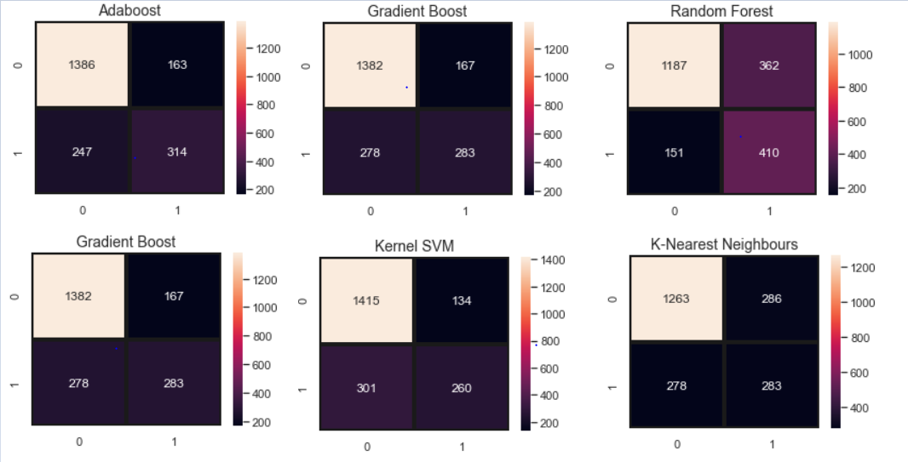

# 📊 Telecom Customer Churn Prediction


## 📌 Project Overview
Customer churn occurs when customers stop doing business with a company. In the highly competitive telecom industry, the annual churn rate fluctuates between **15-25%**. 

This project aims to predict "high-risk" customers likely to leave the service. By identifying these individuals early, companies can implement targeted retention strategies, reducing acquisition costs and improving long-term loyalty.

## 🎯 Objectives
* **Quantify Churn:** Identify the percentage of customers transitioning away from the service.
* **Feature Analysis:** Analyze demographic and service-related factors contributing to attrition.
* **Predictive Modeling:** Develop and evaluate Machine Learning models to accurately classify potential churn.

## 📂 Dataset
The analysis uses the **Telco Customer Churn** dataset.
* **Demographics:** Gender, age, partners, and dependents.
* **Services:** Phone, multiple lines, internet (DSL/Fiber optic), and security add-ons.
* **Account Info:** Tenure, contract type, payment method, and billing preferences.

## 🛠️ Tech Stack & Tools
* **Language:** Python
* **Data Handling:** Pandas, NumPy
* **Visualization:** Matplotlib, Seaborn, Plotly
* **Machine Learning:** Scikit-Learn (Logistic Regression, KNN, Random Forest, AdaBoost, Gradient Boosting)

## 📊 Key Visualizations & Insights

| Analysis | Visualization |
| :--- | :--- |
| **Feature Correlation** |  |
| **Model Comparison** |  |
| **Performance Curves** |  |
| **Customer Retention** |  |
| **Prediction Errors** |  |

### **Key Insights:**
* **Contract Type:** 75% of customers on Month-to-Month contracts churned, compared to only 3% for Two-Year contracts.
* **Internet Service:** Fiber optic users show a significantly higher churn rate, suggesting potential service dissatisfaction.
* **Support & Security:** Customers without Tech Support or Online Security are the most likely to migrate to competitors.

## ⚙️ Model Architecture & Evaluation
I implemented a **Voting Classifier** ensemble to maximize predictive power, combining Gradient Boosting, Logistic Regression, and AdaBoost.

### **Final Results (K-Fold Cross Validation):**

| Model | Accuracy |
| :--- | :--- |
| **Voting Classifier (Ensemble)** | **84.68%** |
| Gradient Boosting | 84.46% |
| AdaBoost | 84.45% |
| Logistic Regression | 84.13% |

### **Implementation Snippet:**
```python
from sklearn.ensemble import VotingClassifier

# Ensemble of top-performing models
eclf1 = VotingClassifier(estimators=[
    ('gbc_model', gbc_model), 
    ('lr_model', lr_model), 
    ('adaboost_model', adaboost_model)
], voting='soft')

eclf1.fit(X_train, y_train)

👤 Author
Sanika Full-Stack Developer & AI Enthusiast Specializing in Web Development, Hardware-AI Integration (NeuralKrushi), and Data-Driven Solutions.

LinkedIn: https://www.linkedin.com/in/sanika-karche | GitHub: https://github.com/sanikakarche
